# ZCU - Zero-Config Claude-Code Undo

> 🎭 **A regret medicine of Claude Code for u** 💊

## Changelog

- **2025-09-07 21:26:40**: Initialize project AI context, establish complete architecture documentation
- **2025-09-07**: Complete project infrastructure setup and dependency configuration

## Project Vision

ZCU (Zero-Config Claude-Code Undo) is a comprehensive undo/redo system designed for Claude Code CLI, providing reliable "regret medicine" for AI code operations. The project adopts Fusion Architecture design, incorporating best practices from multiple reference projects, offering zero-configuration file version management and intelligent rollback capabilities.

### Core Value Propositions
- **Zero Configuration**: Out-of-the-box, no complex setup required
- **AI Aware**: Optimized specifically for Claude Code operations
- **Multi-Instance Support**: Supports concurrent work from multiple Claude instances
- **Atomic Operations**: Two-phase commit ensures data safety
- **Internationalization**: Supports bilingual interface (Chinese/English)

## Architecture Overview

### Technology Stack
- **Language**: TypeScript (maintain monorepo consistency)
- **Package Manager**: pnpm with catalogs for categorized dependency management
- **Build Tools**: Turbo + Vite/Unbuild
- **Storage Engine**: LevelDB (lightweight KV storage)
- **Version Control**: Shadow Git Repository (isolated snapshots)
- **UI Framework**: React + Ink (CLI) + Radix UI (Web)

### Module Structure Diagram

```mermaid
graph TD
    A["🏠 ZCU Project Root"] --> B["📱 apps"];
    A --> C["📦 packages"];
    
    B --> D["cli"];
    B --> E["web"];
    
    C --> F["core"];
    C --> G["types"];
    C --> H["ui"];
    C --> I["i18n"];
    C --> J["eslint-config"];
    C --> K["tsconfig"];
    C --> L["unocss-config"];
    
    click D "./apps/cli/CLAUDE.md" "View CLI Application Documentation"
    click E "./apps/web/CLAUDE.md" "View Web Application Documentation"
    click F "./packages/core/CLAUDE.md" "View Core Logic Documentation"
    click G "./packages/types/CLAUDE.md" "View Type Definitions Documentation"
    click H "./packages/ui/CLAUDE.md" "View UI Components Documentation"
    click I "./packages/i18n/CLAUDE.md" "View Internationalization Documentation"
    click J "./packages/eslint-config/CLAUDE.md" "View ESLint Config Documentation"
    click K "./packages/tsconfig/CLAUDE.md" "View TypeScript Config Documentation"
    click L "./packages/unocss-config/CLAUDE.md" "View UnoCSS Config Documentation"
```



## Module Index

| Module Path | Type | Description | Status | Tech Stack |
|-------------|------|-------------|--------|------------|
| [`apps/cli`](./apps/cli/CLAUDE.md) | Application | ZCU Command Line Interface based on Commander + Ink | 🚧 In Development | TypeScript, Ink, Commander |
| [`apps/web`](./apps/web/CLAUDE.md) | Application | ZCU Web Control Panel | 🎯 Planned | React, Vite, UnoCSS |
| [`packages/core`](./packages/core/CLAUDE.md) | Core Package | Core logic engine and storage system | 🚧 In Development | LevelDB, simple-git, Commander |
| [`packages/types`](./packages/types/CLAUDE.md) | Type Package | TypeScript type definitions | ✅ Complete | TypeScript |
| [`packages/ui`](./packages/ui/CLAUDE.md) | Component Package | Cross-platform React UI component library | 🎯 Planned | React, Radix UI, CVA |
| [`packages/i18n`](./packages/i18n/CLAUDE.md) | Utility Package | Internationalization support (Chinese/English) | ✅ Complete | i18next, fs-backend |
| [`packages/eslint-config`](./packages/eslint-config/CLAUDE.md) | Config Package | ESLint configuration standards | ✅ Complete | ESLint, React plugins |
| [`packages/tsconfig`](./packages/tsconfig/CLAUDE.md) | Config Package | TypeScript configuration templates | ✅ Complete | TypeScript |
| [`packages/unocss-config`](./packages/unocss-config/CLAUDE.md) | Config Package | UnoCSS style configuration | ✅ Complete | UnoCSS, PostCSS |

## Development & Operations

### Environment Requirements
- **Node.js**: >=18.0.0
- **pnpm**: >=8.0.0 (recommended 10.15.1+)
- **Git**: Modern version (for Shadow Repository)

### Quick Start

```bash
# Install dependencies
pnpm install

# Start development mode
pnpm dev

# Build all packages
pnpm build

# Run tests
pnpm test

# Type checking
pnpm typecheck

# Code formatting
pnpm lint:fix
```

### CLI Usage Examples

```bash
# Create checkpoint
zcu cp [name] --desc "description"

# Undo operations
zcu undo --interactive --preview

# Redo operations
zcu redo --force

# List checkpoints
zcu list --all

# Restore to checkpoint
zcu restore <name> --preview

# View status
zcu status --verbose
```

## Testing Strategy

### Testing Framework
- **Unit Tests**: Vitest (all packages)
- **Integration Tests**: Vitest + mock file system
- **End-to-End Tests**: Planned with real Git repositories

### Test Coverage
- **Core Package**: Storage layer, operation engine, session management
- **CLI Package**: Command processors, user interaction
- **Types Package**: Type export integrity verification
- **I18n Package**: Translation file loading and formatting

### Test Categories
- 🧪 **Unit Tests**: `*.test.ts` (fast, isolated)
- 🔗 **Integration Tests**: `*.integration.test.ts` (cross-module)
- 📦 **Package Tests**: `exports.test.ts` (export verification)

## Coding Standards

### Code Style
- **ESLint**: Custom configuration based on `@antfu/eslint-config`
- **Formatting**: Prettier built into ESLint
- **Commit Convention**: Conventional Commits (via commitlint)
- **Git Hooks**: Husky + lint-staged

### File Naming
- **Components**: PascalCase (`ButtonComponent.tsx`)
- **Utility Functions**: camelCase (`formatMessage.ts`)
- **Type Definitions**: PascalCase (`OperationType.ts`)
- **Config Files**: kebab-case (`eslint.config.ts`)

### Import Rules
- **Relative Imports**: Use relative paths within same module
- **Absolute Imports**: Use workspace paths for cross-package imports
- **Type Imports**: Explicit `import type` declarations

## Core Development Principles

### Monorepo Standards
- **Package Management**: Use pnpm with catalogs, `workspace:*` for internal dependencies
- **Module Architecture**: Clear separation between `apps/*` (applications) and `packages/*` (reusable modules)  
- **Build System**: Turbo for task orchestration, proper pipeline dependencies

### Documentation & Language
- **Code Documentation**: English for all code comments, API docs, and commit messages
- **User Interface**: Bilingual support (zh-CN/en) via i18next with namespace organization
- **Technical Docs**: English for README and technical documentation

### Development Standards
- **Test-Driven Development**: Write tests BEFORE implementation, 80% minimum coverage
- **Test Types**: `*.test.ts` (unit), `*.integration.test.ts` (cross-module), `exports.test.ts` (API)
- **Type Safety**: Strict TypeScript, explicit type imports, comprehensive definitions in `packages/types`
- **Code Quality Assurance**: After every code edit, ensure TypeScript compilation (`pnpm typecheck`) and ESLint validation (`pnpm lint`) pass successfully
- **Quality**: Follow SOLID principles, maintain consistency across error handling and patterns

## AI Development Guidelines

### AI Interaction Best Practices

1. **Clear Module Boundaries**: Each package has well-defined responsibilities
2. **Type Safety**: All APIs have complete TypeScript definitions
3. **Test-Driven**: Important features have corresponding test cases
4. **Documentation First**: Each module has detailed CLAUDE.md documentation

### Common AI Development Scenarios

- **Add New Command**: Create in `apps/cli/src/commands/`
- **Extend Core Features**: Implement in `packages/core/src/`
- **Add UI Components**: Develop in `packages/ui/src/components/`
- **Add Translations**: Add to `packages/i18n/src/locales/`

### AI Code Generation Guidelines

- **Use Existing Types**: Reference definitions in `packages/types/src/`
- **Follow Existing Patterns**: Reference similar file implementations
- **Maintain Consistency**: Use unified error handling and logging patterns
- **Consider Internationalization**: New features should support bilingual interface

## Key Design Decisions

### Fusion Architecture Advantages
- **Storage Optimization**: LevelDB replaces SQLite for lighter weight
- **Git Integration**: Shadow Repository implements isolated file snapshots
- **Session Management**: AI workspace isolation, supports multi-instance concurrency
- **Atomic Operations**: Two-phase commit ensures data integrity

### Technology Selection Rationale
- **Turbo**: Efficient monorepo build system
- **pnpm catalogs**: Unified version management, reduces dependency conflicts
- **Ink**: React-based CLI, provides rich interactive experience
- **i18next**: Mature internationalization solution

---

*📍 This document was auto-generated by ZCU Architecture Initializer - Based on repository state at 2025-09-07 21:26:40*