> 本文是解密 Claude Code 系列三：深入剖析 cursor、Claude code 的状态回滚系统设计与实现

Claude Code 等 AI 编程助手正在重塑软件开发流程，它们具备自主修改代码、重构项目、批量处理文件的强大能力。然而，这种强大能力也带来了新的挑战：当 AI 执行错误操作时，传统的 Ctrl+Z 机制无法应对跨文件、跨工具的复杂回滚需求。

本文将深入剖析 AI 编程工具中"后悔药"机制的设计原理和技术实现，探讨如何构建一个既安全又高效的状态回滚系统。

该“后悔药”机制后续会以组件的形式集成到 ClaudeX 中。

ClaudeX: https://github.com/DevHorizonLabs/ClaudeX

Timi(整理后开源): https://github.com/DevHorizonLabs/Timi

## 什么是"后悔药"机制

"后悔药"机制本质上是一个智能化的检查点系统（Checkpoint System），它为 AI 编程助手提供了完整的状态回滚能力。与传统的文本编辑器撤销功能不同，这个系统需要处理：

- **多文件的批量修改回滚**：AI 可能同时修改数十个文件，需要原子性地回滚所有变更
- **对话历史的一致性维护**：回滚后需要确保 AI 的上下文信息与文件状态保持同步
- **工具调用链的完整恢复**：AI 的操作往往涉及多个工具的组合使用，回滚时需要恢复整个操作链的状态

这种机制让开发者可以放心地让 AI 执行高风险操作，因为任何时候都可以一键回到安全状态。

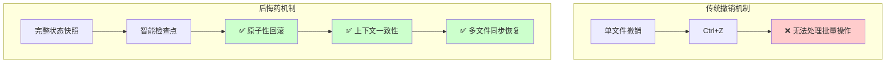

## 技术挑战与设计目标

AI 编程助手的操作特点决定了传统撤销机制的局限性。在典型的重构场景中，AI 助手可能在短时间内修改数十个文件，这种批量操作的特性带来了三个核心挑战：

**批量操作的不可逆性**：AI 在几秒内完成的文件修改操作，无法通过编辑器的单次撤销来回滚。每个文件的修改历史相互独立，缺乏统一的回滚点。

**复杂性爆炸**：AI 的单次操作可能涉及多种工具的组合使用——文件读写、代码分析、依赖管理等。这些复合操作形成了复杂的状态变更链，传统的线性撤销机制无法处理这种多维度的状态回滚需求。

**状态一致性要求**：AI 助手的有效运行依赖于完整的上下文信息，包括对话历史、文件状态、工具调用记录等。单纯的文件回滚无法保证这些关联状态的一致性。

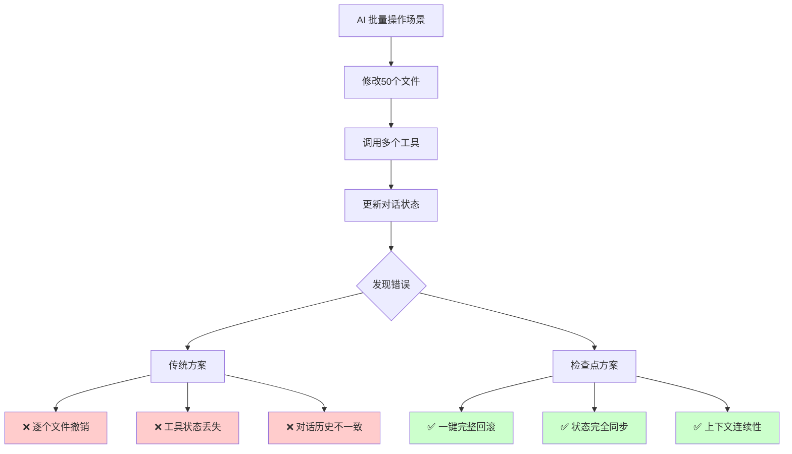

设计目标是构建一个满足以下要求的检查点系统：

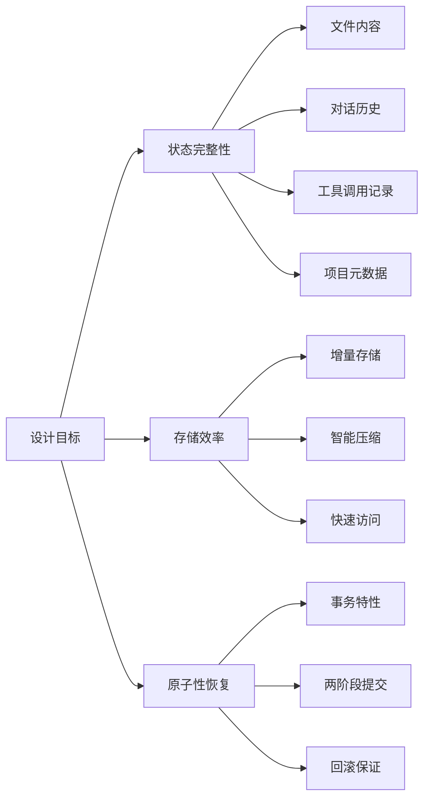

## 核心技术原理

### Shadow Repository：隔离式状态管理

检查点系统的核心设计是 Shadow Repository 机制，它为每个项目创建一个独立的 Git 仓库来管理状态快照：

```typescript
interface ShadowRepository {
  // 项目文件的完整副本，独立的 Git 仓库
  readonly shadowPath: string; // ~/.react-checkpoint/history/<project_hash>/
  readonly originalPath: string; // 用户的实际项目路径

  // 核心能力
  createSnapshot(): Promise<GitSnapshot>;
  restoreSnapshot(commitHash: string): Promise<void>;
}
```

Shadow Repository 设计的技术优势体现在三个方面：

**完全隔离**：检查点操作在独立的 Git 仓库中进行，与用户项目的版本控制系统完全分离，避免了状态污染和冲突风险。

**标准工具复用**：利用 Git 的成熟版本管理机制，获得了可靠的快照存储、差异比较和历史管理能力，无需重新实现这些复杂功能。

**操作透明性**：用户的正常开发流程完全不受影响，检查点的创建和管理在后台异步执行，不会阻塞或干扰用户操作。

Shadow Repository 的工作流程：

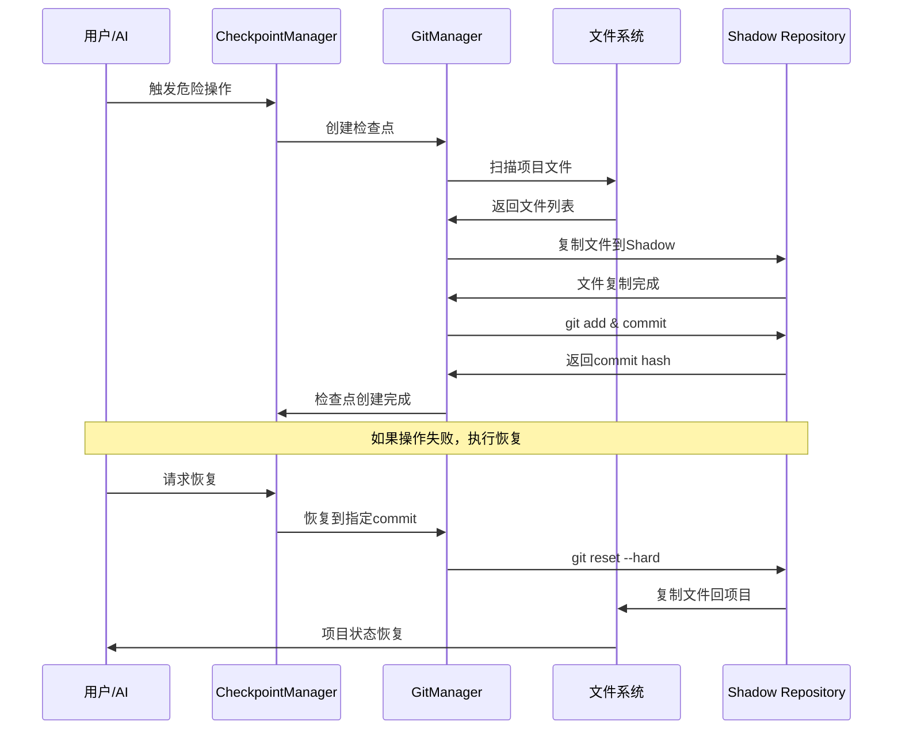

目录结构设计：

```bash
~/.react-checkpoint/
├── history/<project_hash>/    # Shadow Repository
│   ├── .git/                  # Git 仓库元数据
│   ├── src/                   # 项目文件快照
│   └── package.json           # 配置文件快照
└── metadata/<project_hash>/   # 检查点元数据
    ├── checkpoint-uuid1.json  # 检查点详细信息
    └── checkpoint-uuid2.json  # 工具调用和对话历史
```

### 系统架构设计

检查点系统采用分层架构，每一层都有明确的技术职责：

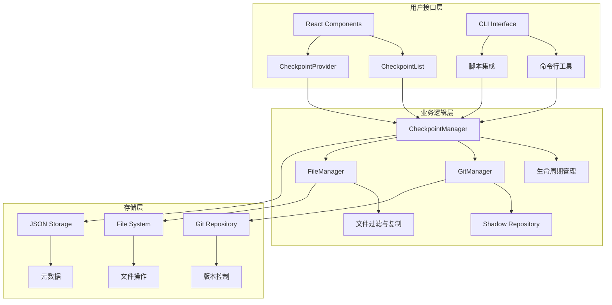

## 关键技术实现

### 智能触发机制

检查点的创建时机直接影响系统性能和保护效果。系统实现了基于风险评估的智能触发策略：

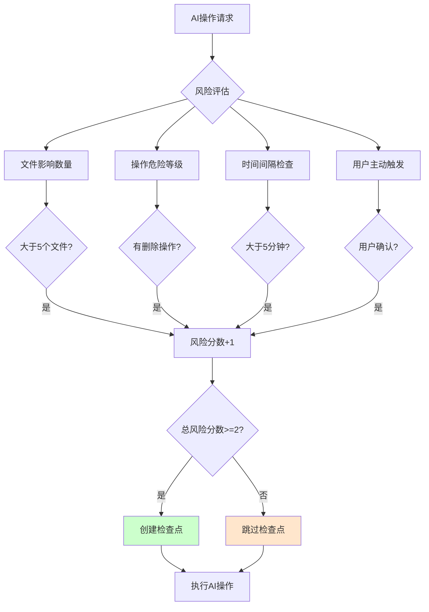

```typescript
// 智能触发策略
class CheckpointTrigger {
  shouldCreateCheckpoint(context: OperationContext): boolean {
    const riskFactors = [
      context.filesAffected > 5, // 影响文件数
      context.hasDestructiveOperation, // 是否有删除操作
      context.isUserInitiated, // 用户主动触发
      context.timeSinceLastCheckpoint > 300000, // 距离上次超过5分钟
    ];

    return riskFactors.filter(Boolean).length >= 2;
  }
}
```

### 高性能文件过滤

大型项目需要智能的文件过滤机制来优化性能：

```typescript
class PerformantFileFilter {
  private compiledPatterns: RegExp[];

  shouldIgnore(filePath: string): boolean {
    // 快速路径：常见忽略项
    if (this.isCommonIgnorePattern(filePath)) {
      return true;
    }

    // 正则匹配：用户配置的模式
    return this.compiledPatterns.some((pattern) => pattern.test(filePath));
  }

  private isCommonIgnorePattern(path: string): boolean {
    return path.includes('node_modules') || path.includes('.git') || path.endsWith('.log');
  }
}
```

### 原子性恢复机制

恢复操作采用两阶段提交协议，确保事务的原子性：

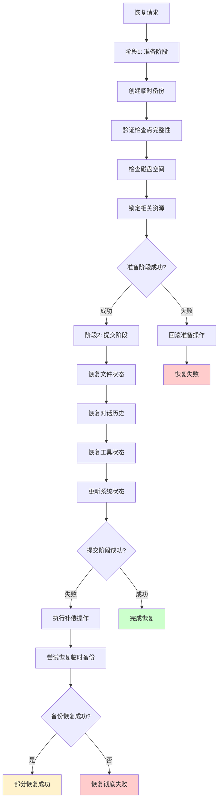

```typescript
class AtomicRestore {
  async restoreCheckpoint(checkpointId: string): Promise<void> {
    const rollbackActions: (() => Promise<void>)[] = [];

    try {
      // 1. 创建临时备份
      const tempBackup = await this.createTempBackup();
      rollbackActions.push(() => this.removeTempBackup(tempBackup));

      // 2. 开始恢复过程
      await this.performRestore(checkpointId);

      // 3. 验证恢复结果
      await this.validateRestore(checkpointId);
    } catch (error) {
      // 4. 出错时执行回滚
      for (const rollback of rollbackActions.reverse()) {
        try {
          await rollback();
        } catch (rollbackError) {
          console.error('回滚失败:', rollbackError);
        }
      }
      throw error;
    }
  }
}
```

### 状态管理实现

系统使用 Zustand 进行状态管理，实现了简洁高效的状态控制：

```typescript
interface CheckpointState {
  checkpoints: CheckpointMetadata[];
  currentCheckpoint: CheckpointData | null;
  status: 'idle' | 'creating' | 'restoring' | 'error';
  error: string | null;
}

const useCheckpointStore = create<CheckpointState>((set, get) => ({
  checkpoints: [],
  status: 'idle',

  createCheckpoint: async (toolCall, conversation) => {
    set({ status: 'creating' });

    try {
      const checkpoint = await get().manager?.createCheckpoint(toolCall, conversation);

      set((state) => ({
        checkpoints: [...state.checkpoints, checkpoint],
        status: 'idle',
      }));
    } catch (error) {
      set({ status: 'error', error: error.message });
    }
  },
}));
```

选择 Zustand 的原因：零模板代码、TypeScript 友好、内置性能优化。

系统状态转换图：

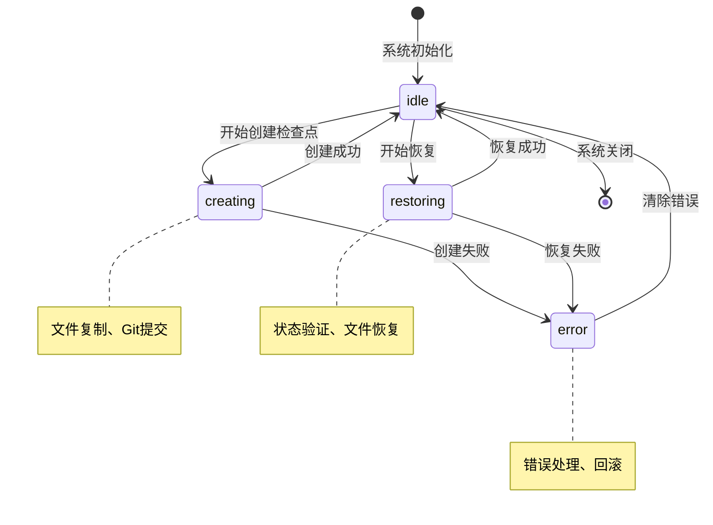

## 性能与扩展性优化

### 增量快照技术

为了避免重复存储，系统实现了增量快照机制：

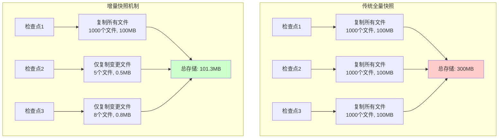

技术实现原理：

```typescript
class IncrementalCheckpoint {
  private lastSnapshot: string | null = null;

  async createSnapshot(): Promise<GitSnapshot> {
    const changedFiles = await this.getChangedFiles();

    if (changedFiles.length === 0 && this.lastSnapshot) {
      // 没有变更，复用上次快照
      return this.getSnapshotByHash(this.lastSnapshot);
    }

    // 只处理变更的文件
    return this.createIncrementalSnapshot(changedFiles);
  }
}
```

### 智能并发处理

系统对读写操作进行分类处理，提升执行效率：

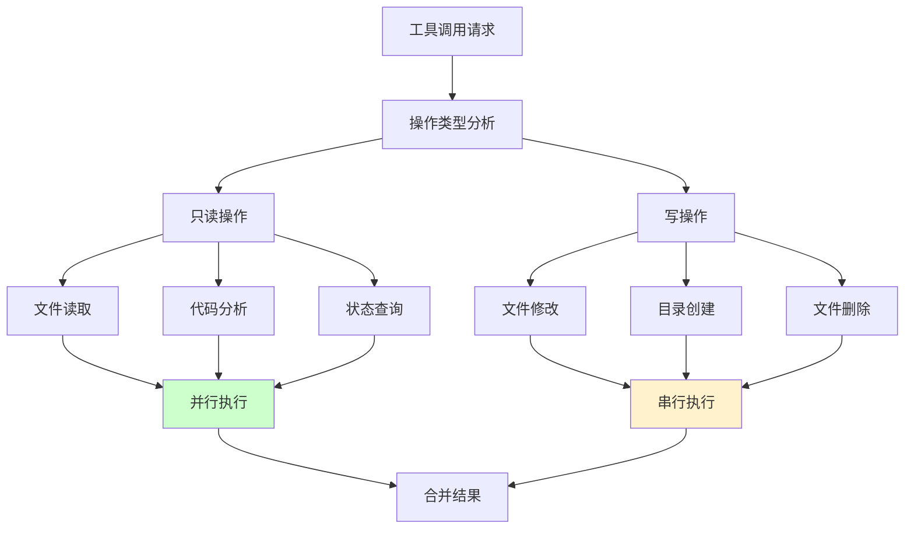

性能对比：

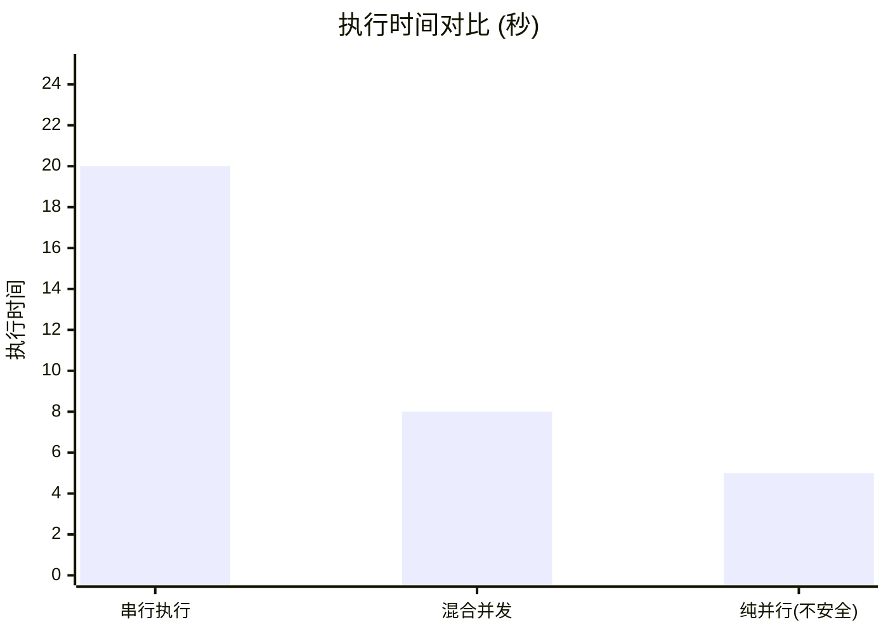

技术实现：

```typescript
async function executeTools(toolCalls: ToolCall[]): Promise<ToolResult[]> {
  const readOnlyTools = toolCalls.filter(isReadOnly);
  const writeTools = toolCalls.filter(isWrite);

  // 并行执行只读工具
  const readResults = await Promise.all(readOnlyTools.map((tool) => executeTool(tool)));

  // 串行执行写操作工具
  const writeResults = [];
  for (const tool of writeTools) {
    const result = await executeTool(tool);
    writeResults.push(result);
  }

  return [...readResults, ...writeResults];
}
```

### 插件化扩展架构

系统支持通过插件机制扩展功能：

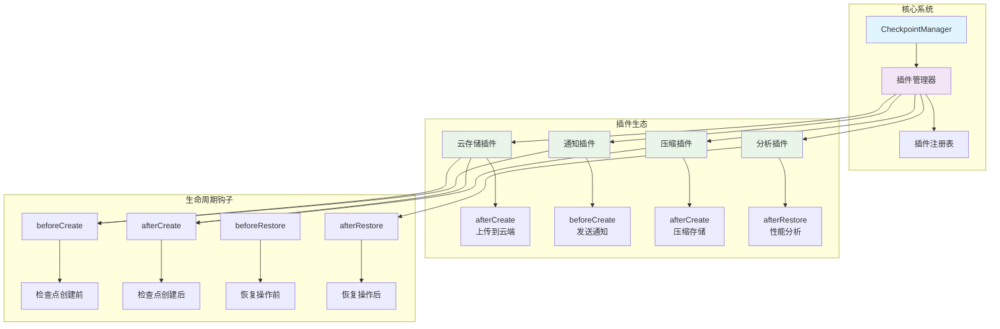

插件接口定义：

```typescript
interface CheckpointPlugin {
  name: string;
  initialize(manager: CheckpointManager): void;

  // 生命周期钩子
  beforeCreate?(context: CheckpointContext): Promise<void>;
  afterCreate?(checkpoint: CheckpointData): Promise<void>;
  beforeRestore?(checkpointId: string): Promise<void>;
  afterRestore?(checkpoint: CheckpointData): Promise<void>;
}

// 云存储插件示例
class CloudStoragePlugin implements CheckpointPlugin {
  name = 'cloud-storage';

  async afterCreate(checkpoint: CheckpointData): Promise<void> {
    await this.uploadToCloud(checkpoint);
  }
}
```

## 核心设计原则

检查点系统的设计实践总结出几个关键的架构设计原则：

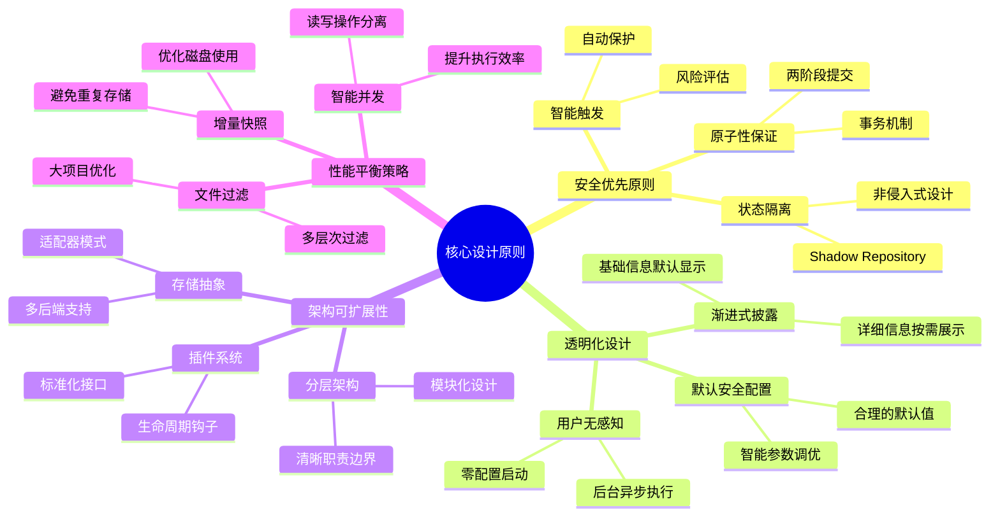

### 安全优先原则

系统的每个技术决策都优先考虑数据安全：

- **状态隔离**：Shadow Repository 确保操作不影响原项目
- **原子性保证**：两阶段提交确保恢复操作的完整性
- **智能触发**：基于风险评估的自动保护机制

### 透明化设计

复杂的底层实现通过简洁的接口对外提供服务：

- **用户无感知**：检查点操作在后台异步执行
- **渐进式披露**：详细信息仅在需要时显示
- **默认安全配置**：零配置即可获得保护

### 架构可扩展性

通过模块化和插件化支持系统演进：

- **分层架构**：清晰的职责边界便于维护和扩展
- **插件系统**：标准化的扩展接口支持定制化需求
- **存储抽象**：支持多种后端存储方案

### 性能平衡策略

在安全性和效率之间找到最优平衡：

- **增量快照**：避免重复存储，优化磁盘使用
- **智能并发**：读写操作分离，提升执行效率
- **文件过滤**：多层次过滤机制处理大型项目

这些设计原则为构建可靠的智能工具安全机制提供了实践指导，同样适用于其他需要状态管理和回滚能力的复杂系统。

## 系统技术架构总览

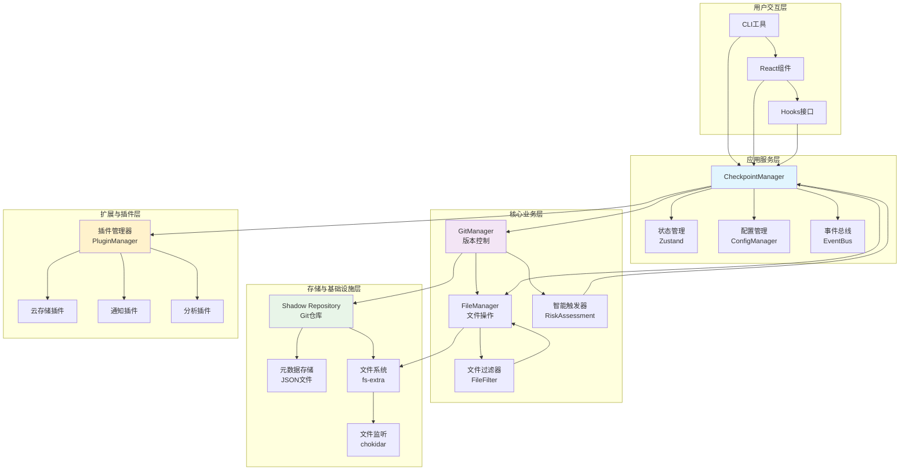

---

## 技术参考

- [Claude Code 工具调用机制](https://docs.anthropic.com/claude/docs)
- [Git 内部原理与版本控制](https://git-scm.com/book/en/v2/Git-Internals-Git-Objects)
- [TypeScript 高级类型系统](https://www.typescriptlang.org/docs/handbook/advanced-types.html)
- [现代前端状态管理模式](https://github.com/pmndrs/zustand)
- [软件架构设计原则](https://martinfowler.com/architecture/)
